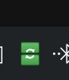
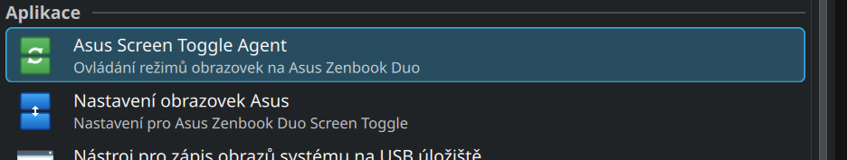
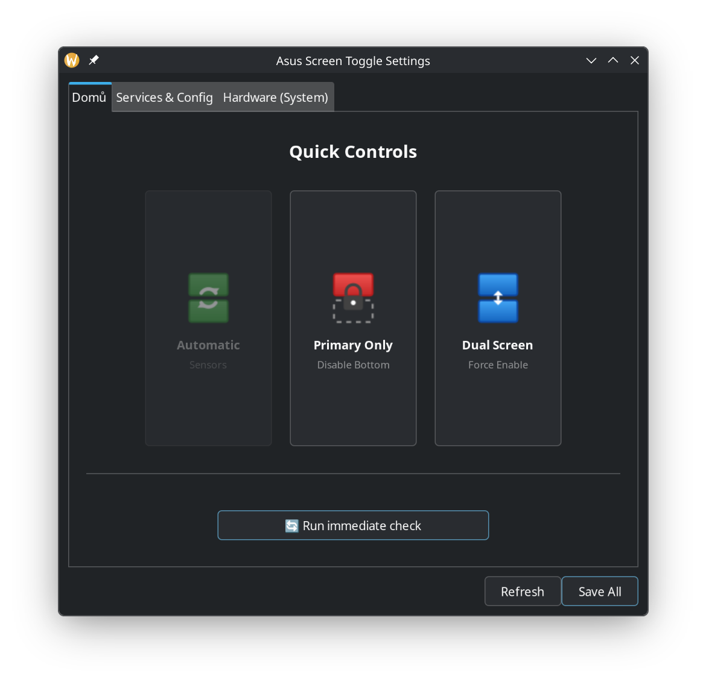
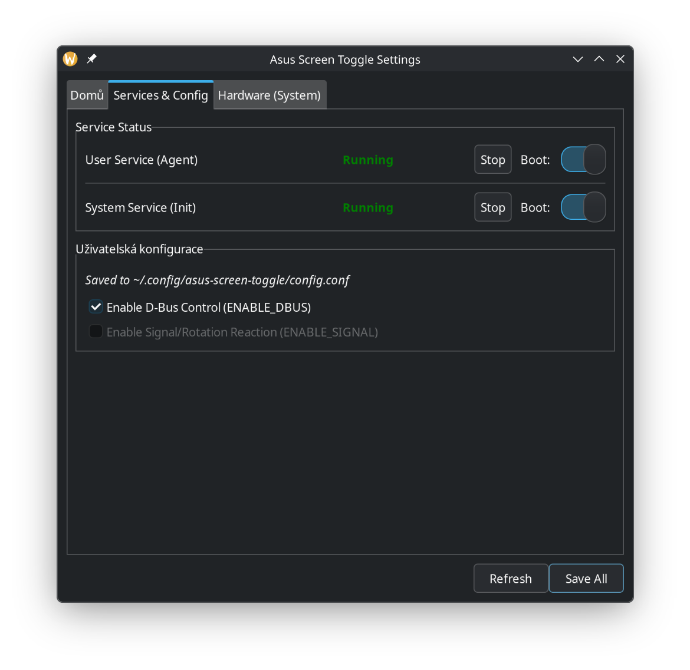
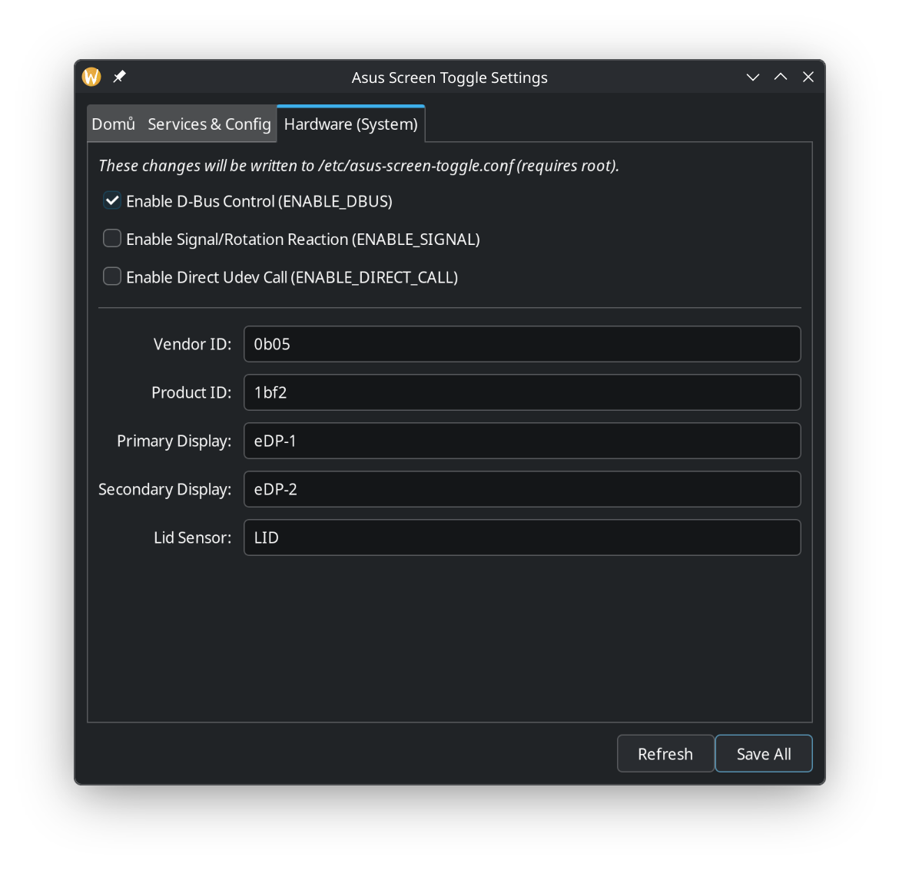

### Tray Icon
<p align="center">
  
</p>

### Menu Items
<p align="center">
  
</p>

### Settings Application
<p align="center">
  
  <br>
  <em>Quick controls and status</em>
</p>

<p align="center">
  
  <br>
  <em>Quick controls and service status</em>
</p>

<p align="center">
  
  <br>
  <em>Hardware configuration (Vendor ID, Display names)</em>
</p>


# Asus Screen Toggle
 
A lightweight utility for **Asus Zenbook Duo (2024+)** and similar dual-screen laptops running Linux (Debian/KDE/Wayland/X11).à
 
This tool automatically manages your secondary (bottom) screen based on physical keyboard attachment, laptop orientation, and lid status.à
 
## Features
- **Automatic Toggle:** Switches the bottom screen ON/OFF when you attach or remove the physical keyboard (Bluetooth or Pogo-pins).
- **Rotation Awareness:** Integrated support for screen rotation events via `monitor-sensor`.
- **Intelligent Logic:** Uses a smart AND-logic for configuration:
  - **System Global:** `/etc/asus-screen-toggle.conf` (Admin lock).
  - **User Local:** `~/.config/asus-screen-toggle/user.conf` (User preference).
- **GUI Settings:** Modern GTK3 configuration panel to adjust hardware IDs and behaviors.
- **System Tray:** Real-time status icon (KDE SNI & AppIndicator support) with mode switching:
  - ** Auto:** Sensors decide.
  - ** Primary Only:** Force bottom screen OFF.
  - ** Dual Screen:** Force bottom screen ON.à
 
## Installation
  
### Using Debian Package (Recommended)
1. Download the latest `.deb` package from the Releases page.
2. Install it using:
   ```bash
   sudo apt install ./asus-screen-toggle_1.0.1_all.deb
   ```
  
### Building from Source
```@bash
git clone https://github.com/antoninmicka/asus-screen-toggle.git
cd asus-screen-toggle
dpkg-buildpackage -us -uc
sudo apt install ../asus-screen-toggle_1.0.1_all.deb
```
 
## Configuration
The tool manages two configuration levels. The agent will only trigger if **both** are set to `true`:
- **Global:** `/etc/asus-screen-toggle.conf` (Managed via `debconf` during install or GUI with `pkexec`).
- **User:** `~/.config/asus-screen-toggle/user.conf` (Managed via the Settings app).

Requirements
- kscreen-doctor (standard in KDE Plasma)
- python3-gi, pydbus, ayatana-indicator
- udev, envsubst, iio-sensor-proxy (for rotation awareness)

License

GPL-3.0 License. See LICENSE for details.
